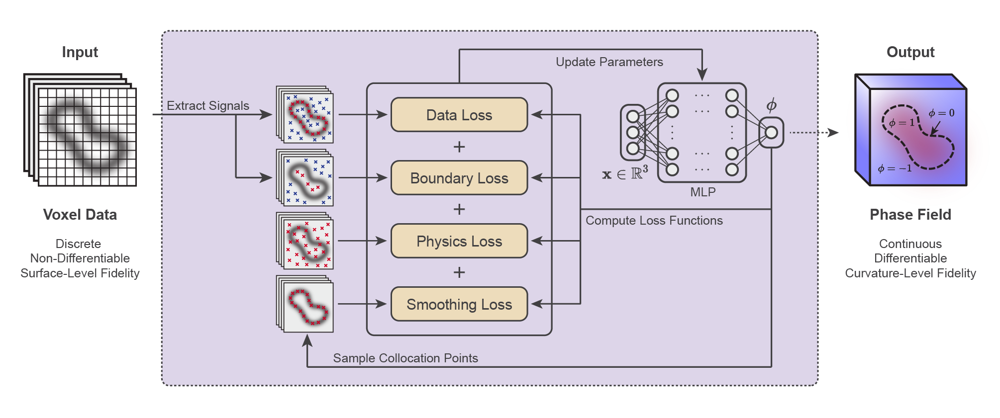

# PINN: Physics-Informed Neural Networks for Membrane Reconstruction and Curvature Estimation

PINN is a physics-informed framework for reconstructing smooth membrane geometries from volumetric electron microscopy data. Instead of representing membranes as discrete voxels or meshes, the framework learns a continuous **implicit neural representation (INR)** of the membrane surface, enabling direct computation of differential geometric quantities such as surface normals, mean curvature, and Gaussian curvature.

To improve geometric accuracy under noisy and incomplete imaging conditions, membrane mechanics are incorporated into the optimization through a **physics-informed neural network (PINN)** framework. The resulting membrane reconstruction is consistent with both the observed image data and the underlying membrane physics, providing an accurate representation for quantitative membrane analysis.

<p align="center">
  
</p>

---

## Highlights

* Continuous implicit neural representation (INR) of membrane geometry
* Physics-informed optimization using Helfrich-Canham-Evans membrane model
* Direct computation of surface normals, mean curvature, and Gaussian curvature
* End-to-end workflow from volumetric image data to quantitative membrane analysis
* Example dataset and notebooks for reproducing the pipeline

---

## Repository Structure

```text
.
├── asset/                                   # Figures used in the documentation
├── example/                                 # A minimal example demonstrating the workflow
│   ├── data/                                # Example input data
│   └── output/                              # Example reconstruction results
├── notebooks/                               # Step-by-step Jupyter notebooks
│   ├── 1-signal-extraction.ipynb            # Signal extraction from volumetric images
│   ├── 2-phase-field-optimization.ipynb     # Physics-informed phase-field optimization
│   └── 3-curvature-analysis.ipynb           # Surface extraction and curvature analysis
├── src/pinn/                                # Source code of the PINN package
│   ├── analysis.py                          # Analysis of reconstructed membrane geometry
│   ├── model.py                             # Neural network architecture and loss functions
│   ├── plot.py                              # Visualization utilities
│   ├── preprocess.py                        # Data preprocessing and signal point extraction
│   ├── run.py                               # High-level pipeline for PINN optimization
│   ├── train.py                             # Training and optimization routines
│   └── utils.py                             # Utility functions
├── requirements.txt                         # Python package dependencies
├── LICENSE                                  # License information
└── README.md                                # Project overview and usage guide
```

---

## Installation

Clone the repository

```bash
git clone https://github.com/ctleelab/pinn-exploration-model.git
cd pinn-exploration-model
```

Create a Python environment

```bash
conda create -n pinn python=3.12
conda activate pinn
```

Install the required packages

```bash
pip install -r requirements.txt
```

---

## Quick Start

The example workflow is organized into three Jupyter notebooks and should be executed in the following order.

### 1. Signal extraction

```text
notebooks/1-signal-extraction.ipynb
```

This notebook extracts membrane signal points from the input volumetric image.

### 2. Physics-informed phase-field optimization

```text
notebooks/2-phase-field-optimization.ipynb
```

This notebook reconstructs the membrane as a continuous implicit phase field using the extracted signal points and physics-based constraints.

### 3. Curvature analysis

```text
notebooks/3-curvature-analysis.ipynb
```

This notebook extracts the membrane surface from the reconstructed phase field and computes geometric quantities, including the surface normal, mean curvature, and Gaussian curvature.


### Example Data

Example data and reconstruction results are provided under

```text
example/
```
The example dataset consists of an endocytic pit extracted from a focused ion beam scanning electron microscopy (FIB-SEM) volume of an interphase COS-7 cell. The original dataset is available through the OpenOrganelle portal provided by HHMI Janelia Research Campus (Dataset ID: `jrc_cos7-1b`).

---

## Method

The reconstruction pipeline consists of three main steps:

```text
Volumetric image
        │
        ▼
Signal extraction
        │
        ▼
Physics-informed membrane reconstruction
        │
        ▼
Continuous phase field
        │
        ▼
Surface extraction
        │
        ▼
Curvature estimation
```

The membrane geometry is represented as a continuous implicit neural representation, allowing geometric quantities to be computed directly through automatic differentiation. A physics-based regularization derived from membrane mechanics is incorporated during optimization to produce geometrically smooth and physically plausible reconstructions.

---

## Dependencies

The implementation is primarily based on the **JAX/Flax ecosystem** for differentiable programming and neural network optimization.

Additional packages required to run the complete workflow are listed in `requirements.txt`.

---

## Citation

```bibtex
@article{TODO,
  title   = {Physics-Guided Neural Reconstruction of Cellular Membranes for 3D
Microscopy},
  author  = {...},
  journal = {...},
  year    = {...}
}
```

---

## License

This project is released under the MIT License. See the `LICENSE` file for details.


