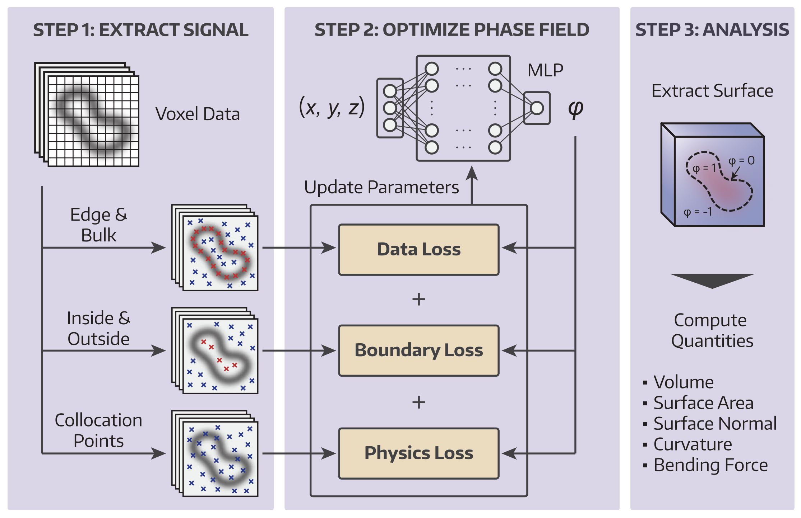

# Physics-Guided Membrane Reconstruction

  

Reconstruct 3D membrane surfaces with curvature-level accuracy using a physics-informed neural network (PINN). The workflow consists of three main steps:

1. Signal extraction  
2. Phase-field optimization  
3. Computation of geometric quantities  

A step-by-step tutorial is provided in the Jupyter notebook, which walks through the full pipeline using a bud-shaped example.